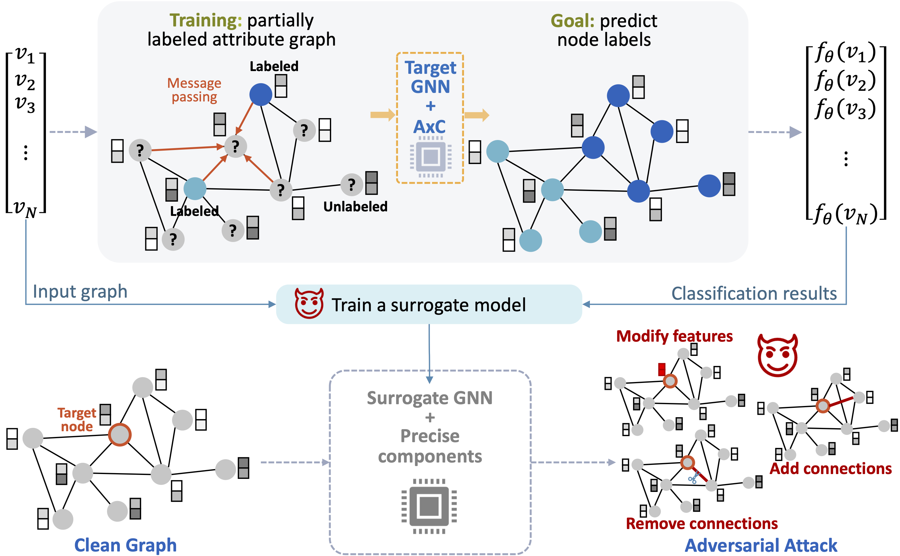

# Deoxys: <u>De</u>fensive Appr<u>oxi</u>mate Computing for <u>S</u>ecure Graph Neural Networks [ASAP'24]

## Overview



## Goal

The primary goal is to apply hardware-supported approximate computing (AxC) operators in GNN computation to improve its robustness.


## Installation

Please refer to [requirements.txt](requirements.txt).

One potential installation commands:
```
pip install deeprobust==0.2.8
pip install torch_geometric     
pip install scipy==1.12.0   
pip install torch==2.1.0 
pip install torch_scatter torch_sparse torch_cluster torch_spline_conv -f https://data.pyg.org/whl/torch-2.1.0+cpu.html
```

## Example
Example execution is in [AxC_GCN_example.ipynb](examples/AxC_GCN_example.ipynb)

**Note**: Although we use ParallelJobs to accelerate the AxC, it still needs a lot of time.


## Contact and Citation
* If there is any question, please shoot an email to nan.wu@gwu.edu
* If you find Deoxys useful, please cite our paper:
   ```
   @inproceedings{su2024deoxys,
      title={Deoxys: Defensive Approximate Computing for Secure Graph Neural Networks},
      author={Su, Haoran and Wu, Nan},
      booktitle={Proceedings of the 35th IEEE International Conference on Application-specific Systems, Architectures and Processors},
      year={2024},
      organization={IEEE}
   }
   ```